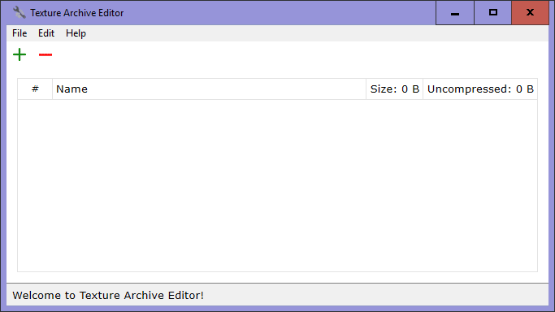

<h1 align="center">
  <b>Texture Archive Editor</b>
   
   
  
</h1>

<h2 align="center"><i>For adding/removing textures from .bin files</i></h2>

## About

Made in response to [this r/programmingrequests post](https://old.reddit.com/r/programmingrequests/comments/xq71rm/need_a_tool_for_editing_a_special_archive/).

## Building

1. Download [scapp.exe](https://gitlab.com/sciter-engine/sciter-js-sdk/-/blob/7a38ab467a08186e2ccf0f5716fed851bf367829/bin/windows/x32/scapp.exe), [sciter.dll](https://gitlab.com/sciter-engine/sciter-js-sdk/-/blob/7a38ab467a08186e2ccf0f5716fed851bf367829/bin/windows/x32/sciter.dll), [inspector.exe](https://gitlab.com/sciter-engine/sciter-js-sdk/-/blob/7a38ab467a08186e2ccf0f5716fed851bf367829/bin/windows/x32/inspector.exe), & [packfolder.exe](https://gitlab.com/sciter-engine/sciter-js-sdk/-/blob/7a38ab467a08186e2ccf0f5716fed851bf367829/bin/windows/packfolder.exe).
2. Put them in this folder.
3. Run `scapp.exe`.

## Preview

<h1 align="center">
  </a>  

  <a href="https://girkovarpa.itch.io/texture-archive-editor#download">
  👉 Download for Windows 👈</a>
</h1>
